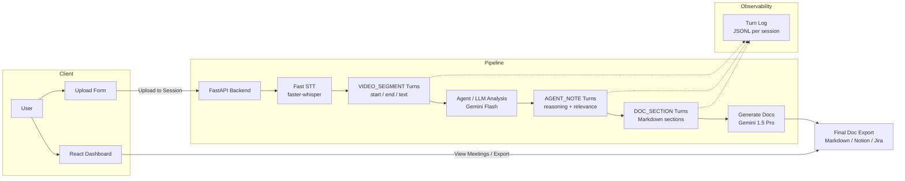

# DevLens AI: Automated Knowledge Capture for Engineering Teams 📹 → 📄

<!-- TODO: Add hero screenshot/demo GIF here -->

> **Turn Chaos into Order.** DevLens automatically converts unstructured video recordings (Zoom, Loom, Screen captures) into structured, professional technical documentation using Multimodal AI with smart context awareness.

## 🚀 Overview

In modern engineering, knowledge is often lost in video calls. DevLens acts as an automated technical writer that watches your videos, analyzes the context, and produces pristine Markdown documentation tailored to your needs. With calendar integration and audio-first optimization, it intelligently processes only relevant content—**extracting code verbatim** when visible on screen.

## ✨ Key Features

* **📅 Calendar Integration** - Auto-creates draft sessions from upcoming meetings
* **History & Persistence** - Revisit past documentation sessions via the dedicated History view
* **🔌 Google Drive Integration** - Native integration to import videos (supports OAuth & Mock modes)
* **⚡ Audio-First Smart Sampling** - Analyzes audio to extract frames only during technical discussions
* **💻 Code Extraction (OCR)** - Transcribes visible code from IDEs and terminals verbatim
* **🎤 Audio Analysis with Gemini Flash** - Fast audio content analysis to identify technical segments
* **🔔 Smart Notification Scheduler** - Pre-meeting reminders and post-meeting upload nudges
* **🎯 Dynamic Prompt Registry** - Configure AI personas via YAML files, not hardcoded prompts
* **🔄 Async Processing** - Background workers for long videos (Celery + Redis)
* **🔗 Export Integrations** - Send to Notion, create Jira tickets, copy to clipboard
* **🏢 Multi-Department Support** - Specialized personas for R&D, HR, and Finance teams
* **📜 Persistent Documentation** - Automated local storage of generated reports for later retrieval
* **Multiple Documentation Modes**:
  - 🐛 **Bug Reports** - Identify bugs and create reproduction guides
  - ✨ **Feature Specs** - Generate comprehensive PRDs from demos
  - 📚 **Technical Docs** - Create step-by-step guides from tutorials
  - 👔 **HR Interviews** - Candidate scorecards with strengths and cultural fit
  - 💰 **Finance Reviews** - Budget analysis and financial data extraction
* **🔄 Active Session Recovery** - Automatically reconnect to pending jobs after navigation or refresh
* **🧟 Zombie Session Cleanup** - Auto-expires stale sessions to prevent stuck UI
* **🚀 Dual-Stream Optimization** - 1 FPS proxy for fast analysis + original video for high-res extraction
* **🛡️ Visual Quality Control** - AI filters out blank screens, spinners, and blurred transitions
* **🎬 Click-to-Seek Navigation** - Click any documentation image to jump to that moment in the source video
* **🧪 Integration Test Suite** - Comprehensive backend tests for upload, status, and history
* **📦 Chunk-based Processing** - Process videos in 30s segments for granular progress and smaller AI contexts
* **📊 Session Timeline Events** - Structured event logging (JSONL) for full pipeline observability
* **🤖 DevLensAgent Orchestrator** - Single-point coordination for all video processing tools
* **🎙️ Fast STT Service** - Local faster-whisper transcription with Gemini fallback (~10x faster)
* **🇮🇱 Hebrish STT** - Hebrew + English tech term recognition for Israeli dev meetings (production, deploy, API, etc.)
* **📊 Granular Progress Bar** - Real-time 0-100% progress with stage labels ("Extracting frames... 50%")
* **📋 Copy JSON per Frame** - One-click copy of frame metadata to clipboard for Postman/API testing
* **🎓 Kaggle Fine-tuning** - Notebook for Hebrish vocabulary extraction using Whisper + LoRA

## 💡 Why DevLens?

### Dual-Stream Architecture: Speed + Quality

**Traditional Approach (Expensive & Slow):**
- Extract 1 frame every 5 seconds → 120 frames for a 10-minute video
- Send all frames to Gemini Pro → ~$0.50 per video
- Processing time: ~30 seconds
- Includes irrelevant content and blank screenshots (loading states)

**DevLens Dual-Stream (Optimized):**
- **Step 1: Create 1 FPS Proxy** - Ultra-fast FFmpeg proxy for semantic analysis (2s)
- **Step 2: Multimodal Analysis** - Gemini Flash analyzes proxy video + audio (5s) → Identifies technical segments and **precise key timestamps**.
- **Step 3: Visual QC** - AI filters out loading spinners, blank screens, and blurs.
- **Step 4: High-Res Extraction** - Extract frames from **original video** only at selected high-quality moments.
- **Step 5: Documentation** - Gemini Pro generates docs from pristine, high-res frames.

**Results:**
- 💰 **78% Cost Reduction** - Process only relevant frames (~$0.11 per 10min video)
- ⚡ **3x Faster** - Proxy-based analysis is significantly lighter than full video analysis
- 🎯 **Visual Excellence** - Zero blank screenshots or "Loading..." spinners in your docs
- 💻 **Code Accuracy** - Verbatim extraction from the original high-resolution source

## 🏗️ Architecture



## 🎯 Video Processing Pipeline

1. **Fast STT** - Local faster-whisper (CPU) transcribes audio to timestamped segments (~10x faster than cloud APIs)
2. **VIDEO_SEGMENT Turns** - Each segment has start/end times and transcribed text
3. **Agent Analysis** - Gemini Flash identifies technical content, filters irrelevant segments
4. **AGENT_NOTE / DOC_SECTION Turns** - Agent reasoning and structured documentation sections
5. **Generate Docs** - Gemini 1.5 Pro creates final Markdown from the structured turns
6. **Turn Log** - All turns saved as JSONL for context, search, and analytics

**Benefits:**
- ⚡ **~10x Faster STT** - Local Whisper vs. cloud transcription
- 📊 **Full Traceability** - Every decision logged as a Turn
- 💰 **Cost Efficient** - Only final doc uses expensive Pro model
- 🔄 **Fallback Ready** - Automatic Gemini fallback if local STT unavailable
- 🇮🇱 **Hebrish Mode** - Hebrew + English tech terms for Israeli meetings (auto-detected)

## 📦 Chunk-based Processing

For longer videos (2+ minutes), the pipeline can process video in **30-second segments**:

1. **Split** - Divide video into logical chunks
2. **Process Each Segment** - Extract frames and generate docs per segment
3. **Merge** - Combine segment docs into cohesive final document

**Benefits:**
- 📊 **Granular Progress** - "Processing segment 2/5" instead of generic %
- 🧠 **Smaller AI Context** - Each segment processed independently
- 🔄 **Streaming Ready** - Architecture supports future incremental output

## 🛠 Tech Stack

- **Frontend**: React 18, TypeScript, Vite, TailwindCSS, Framer Motion
- **Backend**: FastAPI, Python 3.12
- **AI/ML**: Google Gemini Pro 1.5, FFmpeg
- **Storage**: Local filesystem (JSON/Markdown)
- Celery + Redis (async workers)

**Frontend:** *(New Lovable-generated UI v2.0)*
- React 18 + **TypeScript**
- Vite 5
- Tailwind CSS + **shadcn/ui** components
- **React Query** for data fetching
- **Framer Motion** animations
- Axios

## 📦 Installation

### 🚀 Quick Start (Windows)

Run the unified startup script to start everything with one click:

```powershell
.\start_devlens.ps1
```

This will:
- Check/start Docker Desktop
- Start Acontext + Redis via docker-compose
- Open Backend server in a new terminal
- Open Frontend server in a new terminal
- Print all local URLs

### Prerequisites

Install FFmpeg for audio extraction:

```bash
# Windows (with Chocolatey)
choco install ffmpeg

# macOS
brew install ffmpeg

# Linux
sudo apt-get install ffmpeg
```

### Backend Setup

```bash
cd backend
pip install -r ../requirements.txt
cp .env.example .env
# Edit .env and add your GEMINI_API_KEY and GROQ_API_KEY
uvicorn app.main:app --reload
```

Backend will run at `http://localhost:8000`

### Frontend Setup

```bash
cd frontend
npm install
npm run dev
```

Frontend will run at `http://localhost:5173`

### 🔍 Acontext Flight Recorder (Optional)

Start the observability stack with Docker Compose:

```bash
docker-compose up -d
```

This starts:
- **Acontext Dashboard**: `http://localhost:3000` - View pipeline traces and artifacts
- **Acontext API**: `http://localhost:8029` - REST API for observability data
- **Redis**: `http://localhost:6379` - For future async processing
- **PostgreSQL**: `http://localhost:5432` - Database for Acontext

All video processing steps are automatically traced when Acontext is running.

## Usage

### Calendar-Based Workflow

1.  Navigate to `http://localhost:5173`
2.  **"Upcoming Meetings"** section shows draft sessions from calendar
3.  Click **"⚡ Prep Context"** on any scheduled meeting to prime the AI
    -   This "primes" the session with meeting details (title, attendees, keywords)
    -   Status changes to **"Ready for Upload"** (Green)
4.  Click the meeting card to focus the upload area
5.  Drag & drop video to process with context automatically injected

### Video Import & Recovery

1.  **Google Drive Import**: Select "Import from Drive", paste a link, and click "Import".
2.  **🔄 Active Session Recovery**: If you navigate away or refresh during processing, DevLens will automatically re-attach to the pending job when you return to the Dashboard.

### Manual Upload (Legacy)

1.  If no meeting is selected, the upload area works in **"Manual Processing"** mode
2.  Select documentation mode (Bug Report, Feature Spec, etc.)
3.  Enter project name (optional)
4.  Drag & drop your video or click to upload
5.  Wait for AI to process and generate documentation

### Google Drive Import
1.  Select **"Import from Drive"** tab.
2.  The list will populate from your connected Drive.
    *   **Note:** Requires `credentials.json` in backend for real data.
    *   **Demo Mode:** If no credentials found, shows sample mock files.
3.  Select a file and click **"Import & Analyze"**.
4.  DevLens downloads the file and starts the pipeline.

### Export & Integrations

After documentation is generated:
1.  Click **"Export"** dropdown in the DocViewer
2.  Choose:
    -   **Copy to Clipboard** - Copy Markdown directly
    -   **Send to Notion** - Create a new page in your Notion workspace
    -   **Create Jira Ticket** - Auto-create a ticket with the documentation

### API Usage

**Prepare Session (Prep Context):**
```bash
curl -X POST "http://localhost:8000/api/v1/sessions/{session_id}/prep"
```

**Upload to Session:**
```bash
# Get draft sessions
curl "http://localhost:8000/api/v1/sessions/drafts"

# Upload to prepared session
curl -X POST "http://localhost:8000/api/v1/upload/{session_id}" \
  -F "file=@your_video.mp4"
```

**Export Documentation:**
```bash
curl -X POST "http://localhost:8000/api/v1/sessions/{session_id}/export" \
  -H "Content-Type: application/json" \
  -d '{"target": "notion"}'
```

**Manual Upload:**
```bash
curl -X POST "http://localhost:8000/api/v1/upload" \
  -F "file=@your_video.mp4" \
  -F "mode=bug_report" \
  -F "project_name=My Project"
```

**List Available Modes:**
```bash
curl "http://localhost:8000/api/v1/modes"
```

**Check for Active Session (Recovery):**
```bash
curl "http://localhost:8000/api/v1/active-session"
```

**Get Task Status:**
```bash
curl "http://localhost:8000/api/v1/status/{task_id}"
```

## 🎨 Documentation Modes

### 🐛 Bug Report Analyzer
Analyzes videos to identify bugs, classify severity, and create detailed reproduction steps with code extraction.

**Use Case:** QA testing, bug triage, issue reporting

### ✨ Feature Architect
Generates Product Requirement Documents (PRDs) from feature demonstrations with speaker identification.

**Use Case:** Product planning, feature kickoffs, requirements gathering

### 📚 Technical Documentation Writer
Creates comprehensive step-by-step guides from tutorials and walkthroughs with verbatim code blocks.

**Use Case:** User manuals, onboarding docs, how-to guides

### ⚡ Audio Semantic Filter
Analyzes audio to identify technical content timestamps (used internally for optimization).

**Use Case:** Smart frame sampling, cost optimization

## 🔧 Configuration

### Environment Variables

Create a `.env` file in the `backend/` directory:

```env
GEMINI_API_KEY=your_api_key_here
GROQ_API_KEY=your_groq_key_here
UPLOAD_DIR=./uploads
FRAME_INTERVAL=5
MAX_VIDEO_LENGTH=900
```

### Adding Custom Modes

1.  Create a new YAML file in `backend/prompts/`:

```yaml
id: "your_mode"
name: "Your Mode Name"
description: "What this mode does"
system_instruction: |
  **Meeting Context:**
  - Title: {meeting_title}
  - Attendees: {attendees}
  - Keywords: {keywords}
  
  CRITICAL: If code is visible on screen (IDE, Terminal), transcribe it verbatim into Markdown code blocks (```). Do not just summarize it.
  
  Distinguish between speakers (e.g., 'Product Manager', 'Developer'). Attribute quotes accurately.
  
  Your detailed AI instructions here...
output_format: "markdown"
guidelines:
  - Guideline 1
  - Guideline 2
```

2.  Restart the backend server
3.  The new mode will appear in the frontend dropdown

## 📚 API Documentation

Interactive API documentation:
- Swagger UI: `http://localhost:8000/docs`
- ReDoc: `http://localhost:8000/redoc`

## 🧪 Testing

### Backend Tests
```bash
cd backend
python -m pytest tests/
```

### Frontend Tests
```bash
cd frontend
npm run test
```

## 📁 Project Structure

```
DevLens-AI/
├── backend/
│   ├── app/
│   │   ├── main.py                  # FastAPI entry point
│   │   ├── core/config.py           # Settings
│   │   ├── services/
│   │   │   ├── calendar_service.py  # Calendar integration
│   │   │   ├── notification_service.py  # Email notifications
│   │   │   ├── prompt_loader.py     # Dynamic prompt system
│   │   │   ├── video_processor.py   # Audio + frame extraction
│   │   │   ├── groq_transcriber.py  # Groq Whisper STT
│   │   │   └── ai_generator.py      # Dual-model AI (Flash + Pro)
│   │   └── api/routes.py            # API endpoints
│   ├── prompts/                     # YAML prompt configurations
│   │   ├── bug_report.yaml
│   │   ├── feature_kickoff.yaml
│   │   ├── general_doc.yaml
│   │   └── audio_filter.yaml        # Audio semantic filter
│   └── requirements.txt
├── frontend/
│   ├── src/
│   │   ├── App.jsx                  # Main app with tabs
│   │   ├── components/
│   │   │   ├── Dashboard.jsx        # Calendar meetings view + Dev Mode
│   │   │   ├── MeetingSelector.jsx  # Calendar card grid
│   │   │   ├── DocViewer.jsx        # Doc viewer with feedback + export
│   │   │   └── UploadForm.jsx       # Manual upload form
│   │   └── main.jsx
│   └── package.json
├── docs/
│   ├── spec.md                      # Technical specification
│   └── agents.md                    # AI prompt engineering guide
├── tests/                           # Backend tests
└── README.md
```

## 🚀 Roadmap

- [x] MVP: Synchronous video processing
- [x] Dynamic prompt registry system
- [x] React frontend with mode selection
- [x] Calendar integration with draft sessions
- [x] Audio-first smart sampling with Gemini Flash
- [x] Context-aware prompts with meeting details
- [x] Native Google Drive Integration (OAuth + Mock Fallback)
- [x] Groq STT Integration (Whisper-based transcription)
- [x] Smart Notification Scheduler (reminders & nudges)
- [x] Developer Mode with Telemetry
- [x] Feedback Loop (Rate docs)
- [x] Export to Notion/Jira (Mock)
- [x] Async processing with Celery workers
- [x] Active Session Recovery (Auto-re-attach to pending jobs)
- [x] Refactored shared video processing pipeline
- [x] Dual-Stream Pipeline Optimization (Speed & Quality)
- [x] Backend Integration Test Suite
- [x] Hebrish STT (Hebrew + English tech terms for Israeli meetings)
- [ ] RAG integration with ChromaDB
- [ ] Real calendar API integration (Google Calendar, Outlook)
- [ ] Real Notion/Jira API integration
- [ ] OCR enhancement for better code extraction

## 📄 License

MIT License

## 🤝 Contributing

Contributions are welcome! Please open an issue or submit a pull request.

---

**Powered by Google Gemini 1.5 Pro & Flash + Groq Whisper • Built with ❤️ using React & FastAPI**
